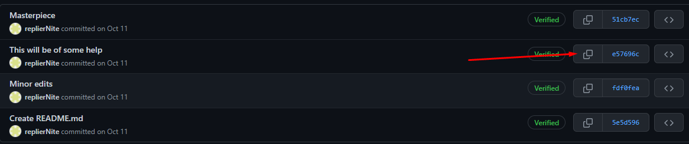
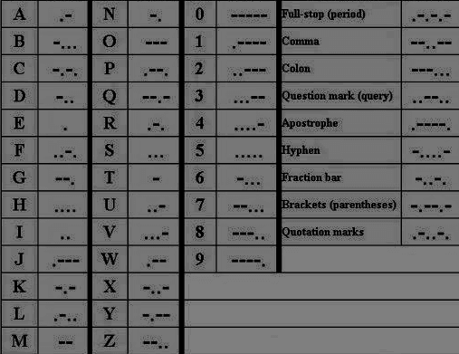

# Crypto
> [WU_File](Files/nite_ctf_crypto.py)
# Osint 
## Mailman 1
Our CTO takes Git commits quite seriously. Someone in our discord channel got an email from him. Now the person wants a similar email signature like the CTO of our company, so he decided to make an email signature of his own and commit it securely. Find the account's mail and wrap it with nite{} for the flag
> Hint: replierNite is the discord account you need to osint
### Solution
- Sau khi tìm được ```replierNite``` trên github truy cập vào repo ```replierNite``` và download file ```confidential.zip```.
- Extract file với password:
> 
- Email cần tìm xuất hiện trong ảnh.
# Forensics
## Qurious Case
Our question creator has deviated from the standard method of making questions. He has hidden and corrupted the flag. Can you recover it?
> [HelloDarknessMyOldFriend.png](Files/HelloDarknessMyOldFriend.png)

### Solution
- Sử dụng stegsolve.jar -> 1 qr code bị mất góc phần tư đầu tiên bên trái.
- Dùng chỉnh sửa ảnh để thêm hình vuông màu đen tiêu chuẩn ở phía trên bên trái để giúp máy quét QR phát hiện nó tốt hơn.
- Up ảnh vừa sửa lên [web](https://merricx.github.io/qrazybox/) -> sau khi web nhận ảnh -> Tools -> Extract QR Information -> Flag.
- Flag: nite{tH@T'$_qRazzYyYy}
## Erased
Saw my drive bloated with images and unecessary files, decided to wipe it. Turns out I removed some important files. I went and recovered them but seems like I still can't find the file or should I say the file contents.

> Challenge Files - https://mega.nz/file/MohmjaQI#IQLuCkv49EJuUH9jlBBXgMB8wmKam0Li4uYy8NC60sU

Wrap with flag format nite{} and replace " - " with " _ "
### Solution
- Download và giải nén file.
- Để ý phần size sẽ có 2 file khác so với phần còn lại.
- Sau khi kiểm tra đc 1 file text và 1 file jpg corrupt.
- Sửa lại phần header của file jpg:
```FF D8 FF E0 00``` -> ```FF D8 FF E0 00 01```
- Dùng steghide extract từ ảnh với pass tìm thấy khi view hex data file: W3LL_TH4T5_4_N34T_H34D3R_CH4NG3
- File extract chứa link để decode morse code từ file text tìm thấy khi nãy.
> 
- File txt tìm thấy:
```
____. ._ _... __... ._. ..... __...
-
__... ._ ._._ _____ .._ ____. ._ .__
-
____. .....
-
._.. _.. ._

```
- Code
```
morse = """
____. ._ _... __... ._. ..... __...
-
__... ._ ._._ _____ .._ ____. ._ .__
-
____. .....
-
._.. _.. ._

"""

morse_dict2 = {
    "_.": "a",
    "..._": "b",
    "._._": "c",
    ".._": "d",
    ".": "e",
    "._..": "f",
    ".__": "g",
    "....": "h",
    "..": "i",
    "___.": "j",
    "_._": "k",
    ".._.": "l",
    "__": "m",
    "._": "n",
    "___": "o",
    ".__.": "p",
    "_.__": "q",
    "._.": "r",
    "...": "s",
    "_": "t",
    "_..": "u",
    "_...": "v",
    "__.": "w",
    "_.._": "x",
    "__._": "y",
    "..__": "z",
    "_____": "0",
    "____.": "1",
    "___..": "2",
    "__...": "3",
    "_....": "4",
    ".....": "5",
    "...._": "6",
    "...__": "7",
    "..___": "8",
    ".____": "9",
    "_._._.": ".",
    "__..__": ",",
    "...___": ":",
    "..__..": "?",
    ".____.": "'",
    "_...._": "-",
    "._.._": "/",
    "_.__._": "(",
    "._.._.": '"'

}


def main():
    morse_lines = morse.split("-")
    morse_lines = [line.replace("\n", "") for line in morse_lines]
    print(morse_lines)
    chars2 = []
    for line in morse_lines:
        for morse_char in line.split(" "):
            chars2.append(morse_dict2[morse_char])
        chars2.append("_")
    flag = "nite{"+"".join(chars2)[:-1]+"}"
    print(flag)

if __name__ == "__main__":
    main()
```
- Flag: nite{1nv3r53_3nc0d1ng_15_fun}
## Dr. Strange
The first to tread the darkest path shall be the shining knight. Four others shall accompany you on your journey. There will be many people fake by heart whom you encounter. But endure. The path shall be long like an infinite expansion, but the rewards shall be your salvation. Note: This one is not for the music lovers. But enjoy what you find =)
> [File](Mighty.jpg)
### Solution
- Extract ảnh ra được 1 đống file zip.
- Sau khi giải nén tất cả ta nhận được tổng cộng 4 file jpeg, 4 file odt, 4 file wav.
- Hex editor -> 4 phần flag từ 4 ảnh.
- Extract 4 file odt ra và tìm 4 file ảnh đen trong đó -> stegsolve -> 4 phần flag.
- [StegoCracker](https://github.com/W1LDN16H7/StegoCracker) -> 4 phần tiếp theo trong 4 file wav
- Ghép thành từ có nghĩa.
- Flag: nite{tH3_n3v3r_g0nn@_g!v3_U_uP}
# Misc
## Hashes Hashes we all fall down
Description: We have captured Mr Brute who is a world renowned architect who has built the safest vault in the world which cannot be broken in anyway unless you have the password. He is also one of the biggest bee movie fans ever (His password was probably a word used in the movie). We were able to get the SHA-256 hash of the password from Mr.Brute by using extreme torture methods (Making him watch the bee movie 2398 times). During this torture, he told us that he was told to prepend the password with a salt before hashing it, so he uses 'salt' as a salt cuz salt is salt. He died soon after we released him (Got stung by a bee, obviously). BUT you have the hash. Decrypt the hash so you can break into his vault. 
> hash = 12f3b9faec781b0e84184a6fa7c44c81416e5b1855633a2a2730295324724efe [Wrap the answer in flag format] Example :- nite{password} NOT nite{salt+password}

### Solution
```
from hashlib import sha256
with open('./sha256.txt', 'r') as f:
    text = f.read()

target = "SHA-256 Hash"

words = [e for e in text.split() if e.isalnum()]

words = list(set(words))

for word in words:
    if(sha256(("salt"+word).encode()).hexdigest() == target):
        print(word)
        exit()
```


